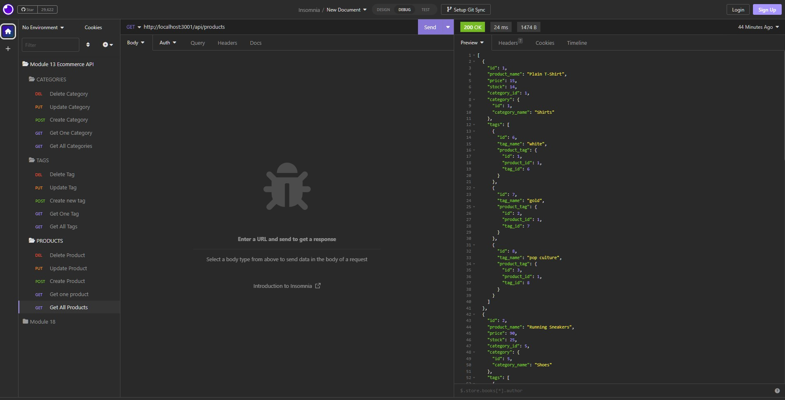

# 13-E-commerce-app
This is a repo for the 13th Challenge from Tec de Monterrey &amp; EdX bootcamp.


## Description

This challenge consisted of an API for an ecommerce website, that handles all of the routes needed to perform CRUD operations using Sequelize and MYSQL2 database to store all of the information from the database. Make sure to have Insomnia or Postman to test these routes!

## Table of contents

- [Installation](#installation)
- [Mockup](#mockup)
- [Video](#video)
- [Credits](#credits)
- [License](#license)
- [Contributing](#contributing)
- [Tests](#tests)
- [Questions](#questions)

## Installation
Please use ```npm i``` to install the dependencies needed for this project (make sure you have Node.JS installed). Use ```npm run seed``` to seed the database to test the routes. Finally use ```npm start``` to run the server.


## Mockup
Create a folder on insomnia like the one on the following image:



Then test routes (post,get,delete,put) on the http://localhost:3001/api/products http://localhost:3001/api/categories & http://localhost:3001/api/tags paths

## Video
Follow this link to a video walktrough 

## Credits
This back-end application acceptance criteria was provided by EdX bootcamps & Tec de Monterrey. The functionality was coded by me with support from a tutor.

## License
This project is licensed under the MIT license.

## Contributing
This repo is not open for contributions.

## Tests
N/A

## Questions
If you have any questions about the repo, open an issue or contact me directly at testemail@hotmail.com. You can find more of my work at [AlexTrejo92](https://github.com/AlexTrejo92).